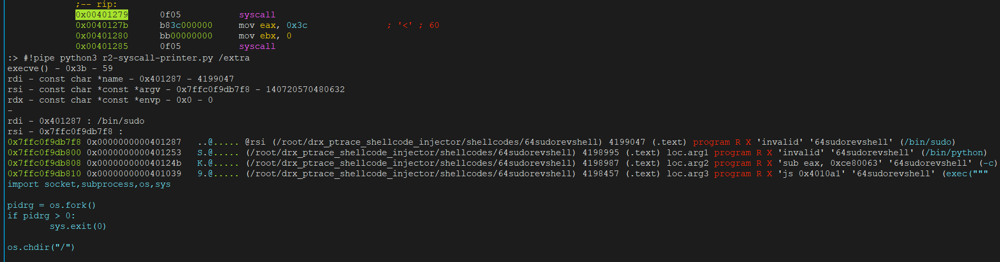
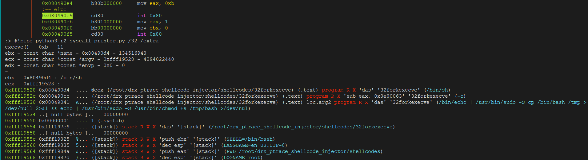

# r2-syscall-printer

**WARNING: this is a POC, and the code is pure CRAP**

The current amd64 call convention in r2 supported is User-level call convention: %rdi, %rsi, %rdx, **%rcx, %r8, %r9**

I created this r2pipe script to support x86 & amd64 kernel interface call convention: %rdi, %rsi, %rdx, **%r10, %r8, %r9**

64 bit process:


32 bit process:


The official r2-support for amd64 kernel interface call convention is comming, check my pr and pancake pr: 
* https://github.com/radareorg/radare2/pull/17954 
* https://github.com/radareorg/radare2/pull/17960

## Usage:

For 64bit processes:
```
#!pipe python3 r2-syscall-printer.py 
```

For 32bit processes inside r2 session use /32: 
```
#!pipe python3 r2-syscall-printer.py /32
```

To display extra info (like in the screenshot image) use /extra:
```
#!pipe python3 r2-syscall-printer.py /extra
#!pipe python3 r2-syscall-printer.py /32 /extra
```

# Credits

Code based & adapted from GEF-extras (syscall-args) by hugsy - GDB Enhanced Features for exploit devs & reversers
* http://gef.rtfd.io/
* https://github.com/hugsy/gef
* https://github.com/hugsy/gef-extras

# TODO

* Improve the code, more pythonic please
* Add support to specify a syscall_index value, something like: #!pipe python3 r2-syscall-printer.py /32 syscall_idex=3

# Contributors

* nobody loves me

